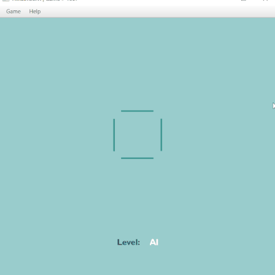

# TicTacToeFX 2.2

## Overview

In this iteration of the game, I revamped the difficulty level logic by adopting the Strategy pattern. This required a significant overhaul of several classes, but leveraging a combination of interfaces and the Strategy pattern notably streamlined the process of adjusting existing logic and introducing new logic based on insights from previous iterations. Additionally, I seamlessly integrated support for SQLite database to facilitate game saves.

During this phase, I extensively utilized ChatGPT, finding it remarkably beneficial in guiding development decisions. Moreover, I revamped the game board, striking a balance between moderate animation and exhaustive information presentation. While individual preferences vary, I personally favor this approach.

Furthermore, I introduced menus and windows that dynamically fetch data from ReadMe.md and the database. Notably, players can now adjust the difficulty level on the fly via a checkbox conveniently placed in the menu.
## Computer Moves Logic

Now, the logic of computer moves is organized as follows:

- **EASY Level** (`class EasyStrategy`): Implements random selection of computer moves.
- **HARD Level** (`class HardStrategy`): Logic based on the minimax method blocks possible winning moves of the player and then searches for winning combinations for itself. It protects center and corner positions if necessary.
- **AI Level** (`class AIStrategy`): Using an evolutionary reinforcement learning algorithm, it analyzes saved games to check the current state of the playing field and compares it to past game experiences stored in the database. It evaluates each possible move by counting the number of matches with winning states from past games and selects the move with the most matches.

These improvements have significantly enhanced the efficiency of computer gameplay and have made the process more enjoyable and challenging for the player.

## Table Structure
### Table `moves`:
- `id`: Unique move identifier.
- `move_number`: The move number within the game.
- `player`: The player who made the move.
- `row`: The row number on the game board (from 0 to 2).
- `col`: The column number on the game board (from 0 to 2).

### Table `games`:
- `id`: Unique game identifier.
- `total_moves`: Total number of moves in the game.
- `player_moves`: Number of moves made by the player.
- `computer_moves`: Number of moves made by the computer.
- `result`: The result of the game (e.g., "Player wins" or "Computer wins").
- `duration`: The duration of the game in seconds.
- `level`: The difficulty level of the game (e.g., "Easy", "Medium", "Hard").
- `game_state`: The game state represented as a string containing information about the placement of Xs and Os on the game board.

## Data Access Methods
- `getTotalGames`: Returns the total number of games played.
- `getLongestGameDuration`: Returns the duration of the longest game.
- `getShortestGame`: Returns the duration of the shortest game (in seconds) and the number of moves in it.
- `getTotalWins`: Returns the total number of wins in the games.
- `getPlayerWins`: Returns the number of wins for a specific player.
- `getWinningGameStates`: Returns a list of winning game states.

## Logging
Logging has been implemented using the standard Java Logging Framework. Errors are logged at the SEVERE level and include information about the exception. Logging improves error tracking and management in the application.

## Graphical interface

Although I know graphic packages, I have no artistic education, so I took the top one from Google as a basis for the new game design.

## Project structure

//TODO
- `src`: contains the source code of the project
- `package1]`: [Description of package contents].
- `[package2]`: [Package Content Description].
- `resources:` contains project resources such as FXML files, images and others
- `docs`: contains project documentation
- `[other directories]`: [Description of other project directories].

## Usage

1. Clone the repository.
2. Compile and run the project using your preferred IDE.
3. Enjoy playing Tic-Tac-Toe against the computer!

## How to Play
1. Start the application and using the top menu select the desired game mode: EASY, HARD, or AI.
2. Make your move by clicking on a cell on the game board.
3. The game continues until one of the players wins or a draw is recorded.
4. To start a new game, click any symbol in the game results box.

## Credits

Graphic interface: Top results from Google Images.

## License
This project is licensed under the MIT (X11) License.

-------------------------

# TikTakToeFX 2.01

## About the Project
TikTakToeFX 2.01 is a refined version of the classic Tic-Tac-Toe game developed using JavaFX platform. This version introduces a more modular and organized code structure by separating the game logic into multiple classes.

## Evolution of the Project
This version represents a significant evolution from TikTakToeFX 2.0:

- **Refactored Code:** The codebase has been refactored to improve modularity and readability by extracting game logic into separate classes.
- **Enhanced Scalability:** The project architecture has been redesigned to support easier integration of new features and scalability.
- **Streamlined Gameplay:** Unnecessary comments, variables, and methods have been removed to streamline the gameplay experience.
- **New Branch:** The changes introduced in this version have been saved as a new branch (2.01) to track the project's evolution.

## Features
- **Play against the computer:** Challenge the computer in Tic-Tac-Toe with improved game logic.
- **Three difficulty levels:** Choose from easy, difficult, or impossible difficulty levels.
- **Simplified Codebase:** The codebase is now more modular and organized, making it easier to maintain and extend.

## System Requirements
- Java 8 or higher
- JavaFX installed

## How to Run
1. Clone the repository to your local machine.
2. Open the project in your Java development environment.
3. Run the application following the instructions of your development environment.

## How to Play
1. Start the application and select the desired game mode: EASY, HARD, or IMPOSSIBLE.
2. Make your move by clicking on a cell on the game board.
3. The game continues until one of the players wins or a draw is recorded.
4. To start a new game, click the "New Game" button in the game results dialog box.

## Screenshots

## License
This project is licensed under the MIT License.
