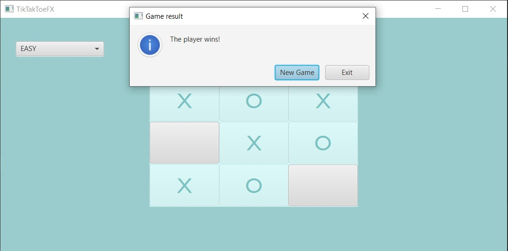
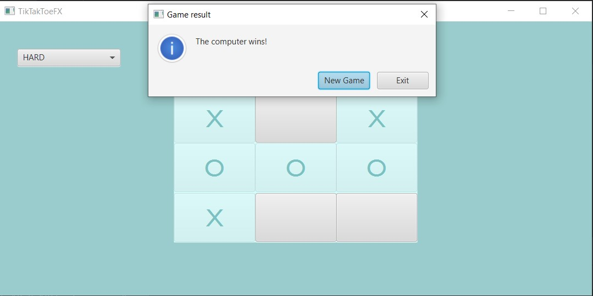
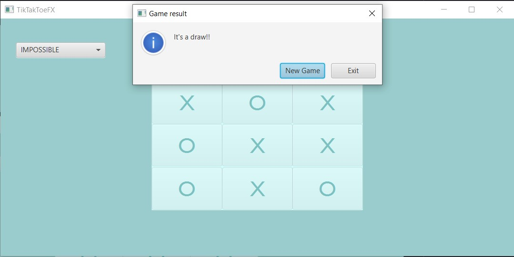

# TikTakToeFX 2.01

## About the Project

TikTakToeFX 2.01 is an enhanced version of the classic Tic-Tac-Toe game developed using JavaFX platform. This version introduces several new features, including the ability to play against the computer at different difficulty levels, a difficulty selection menu, and the option to start a new game without closing the current window. The project has undergone refactoring to improve code structure and readability.

## Features

- **Play against the computer:** Challenge the computer at different difficulty levels: easy, hard, or impossible.
- **Difficulty selection menu:** Choose the difficulty level before starting the game.
- **Start a new game:** Begin a new game without closing the current window.
- **Code refactoring:** Improved code structure and removed unnecessary comments, variables, and methods.

## System Requirements

- Java 8 or higher
- JavaFX installed

## How to Run

1. Clone the repository to your local machine.
2. Open the project in your Java development environment.
3. Run the application following the instructions of your development environment.

## How to Play

1. Start the application and select the desired difficulty level.
2. Make moves by clicking on cells on the game board.
3. The game continues until one player wins or a draw is recorded.
4. To start a new game, click the "New Game" button in the game results dialog box.

## Screenshots

## License

This project is licensed under the [MIT License](LICENSE).
