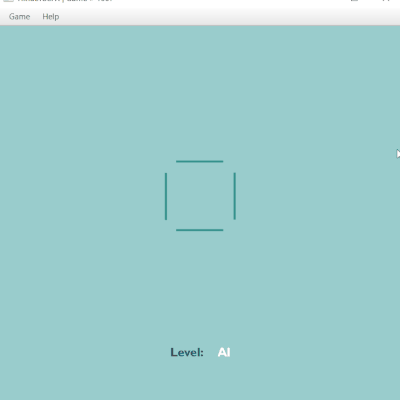
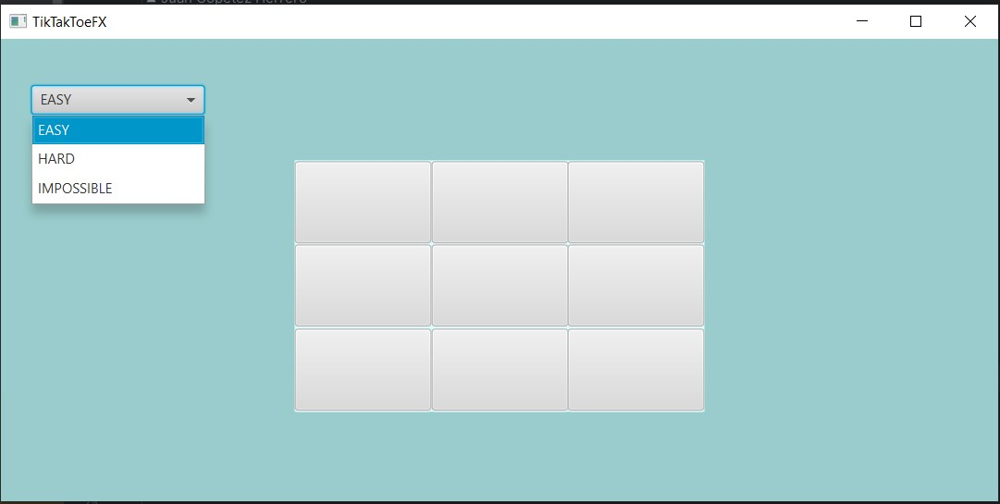

# TicTacToeFX 2.2

## Overview

In this iteration of the game, a major code refactoring was implemented. The logic of computer moves
is now realized using the strategy pattern, and it is reinforced by dependency encapsulation. Game
data is stored in a SQLite database and utilized for reinforcement learning purposes. This approach
opens the door to comprehensive testing.

## Computer Moves Logic

Now, the logic of computer moves is organized as follows:

- **EASY Level** (`class EasyStrategy`): Implements random selection of computer moves.
- **HARD Level** (`class HardStrategy`): Logic based on the minimax method blocks possible winning
  moves of the player and then searches for winning combinations for itself. It protects center and
  corner positions if necessary.
- **AI Level** (`class AIStrategy`): Using an evolutionary reinforcement learning algorithm, it
  analyzes saved games to check the current state of the playing field and compares it to past
  game
  experiences stored in the database. It evaluates each possible move by counting the number of
  matches with winning states from past games and selects the move with the most matches.

These improvements have significantly enhanced the efficiency of computer gameplay and have made the
process more enjoyable and challenging for the player.

## Table Structure

### Table `moves`:

- `id`: Unique move identifier.
- `move_number`: The move number within the game.
- `player`: The player who made the move.
- `row`: The row number on the game board (from 0 to 2).
- `col`: The column number on the game board (from 0 to 2).

### Table `games`:

- `id`: Unique game identifier.
- `total_moves`: Total number of moves in the game.
- `player_moves`: Number of moves made by the player.
- `computer_moves`: Number of moves made by the computer.
- `result`: The result of the game (e.g., "Player wins" or "Computer wins").
- `duration`: The duration of the game in seconds.
- `level`: The difficulty level of the game (e.g., "EASY", "HARD", "AI").
- `game_state`: The game state represented as a string containing information about the
  placement of
  Xs and Os on the game board.

## Data Access Methods

- `getTotalGames`: Returns the total number of games played.
- `getLongestGameDuration`: Returns the duration of the longest game.
- `getShortestGame`: Returns the duration of the shortest game (in seconds) and the number
  of moves
  in it.
- `getTotalWins`: Returns the total number of wins in the games.
- `getPlayerWins`: Returns the number of wins for a specific player.
- `getWinningGameStates`: Returns a list of winning game states.

## Dependency injection approach

In this version of the project, I have used a dependency injection approach
to manage inter-component communication. The global variables of the project
have been encapsulated in the GameParams class. Dependency injection involves
passing dependencies encapsulated in a parameter object (e.g. params) to
methods where they are required. By separating components from specific data
structures or dependencies, this approach promotes modularity, testability,
and maintainability of the entire codebase.

## Logging

Logging has been implemented using the standard Java Logging Framework. Errors are logged at the
SEVERE level and include information about the exception. Logging improves error tracking and
management in the application.

## Graphical interface

Although I know graphic packages, I have no artistic education, so I took the top one from Google as
a basis for the new game design.
[

## Project structure

- **constants**: Holds project-wide constant values
    - `Constants.java`: Defines project constants
- **controller**: Manages the application logic and user interactions
    - `Context.java`: Initializes the interface and handles moves
    - `GameController.java`: Controls the game interface and interactions
    - `GameResultHandler.java`: Manages game results and database interactions
    - `GameResultWindowController.java`: Controls the game result window
    - `GraphicsManager.java`: Handles drawing of winning lines
    - `NewGameSetter.java`: Resets the game and starts a new one
    - `StatWindowController.java`: Manages the content for statistics window
- **database**: Handles database operations
    - `GameMove.java`: Stores game moves
    - `GameRecorder.java`: Records game data in the game database
    - `SQLiteDBManager.java`: Manages SQLite database operations
- **model**: Contains data structures and game logic
    - `GameParams.java`: Representing a set of game ending parameters needed by other classes and
      methods.
    - `GameEngine.java`: Computes game results and winning coordinates
- **strategies**: Implements game playing strategies
    - `AIStrategy.java`: Implements AI game strategy
    - `EasyStrategy.java`: Implements easy level strategy
    - `HardStrategy.java`: Implements hard level strategy
    - `Strategic.java`: Defines the strategy interface
- **view**: Handles presentation and UI components
    - `AboutWindow.java`: Shows the about window
    - `GameResultWindow.java`: Shows the game result window
    - `HowToWindow.java`: Shows the how-to-play window
    - `StatWindow.java`: Shows the statistics window
- **resources**: Contains project resources such as FXML files and images
    - `TTTFX.fxml`: Main game interface FXML file
    - `GameResultWindow.fxml`: Game result window FXML file
    - `StatDialog.fxml`: Statistics window FXML file
    - `TTTFX2.0-ezgif.com-resize.gif`: Animated GIF for the game interface
    - `TTTFX 2.0.gif`: Another animated GIF for the game interface
    - `TTTFX_back.fxml`: Background FXML file for the game interface
    - **assets**: Contains ReadeMe.md resources
        - `TTTFX2.0-ezgif.com-resize.gif`
        - `TTTFX 2.0.gif`
        - `TTTFX 2.0.jpg`
        - `TTTFX 2.01 Screenshot_1.jpg`
        - `TTTFX 2.01 Screenshot_2.jpg`
        - `TTTFX 2.01 Screenshot_3.jpg`
        - `TTTFX 2.2 Screenshot_4.jpg`

## Usage

1. Clone the repository.
2. Compile and run the project using your preferred IDE.
3. Enjoy playing Tic-Tac-Toe against the computer!

## How to Play

1. Start the application and using the top menu select the desired game mode: EASY, HARD, or
   AI.
2. Make your move by clicking on a cell on the game board.
3. The game continues until one of the players wins or a draw is recorded.
4. To start a new game, click any symbol in the game results box.

## Credits

Graphic interface: Top results from Google Images.

## License

This project is licensed under the MIT (X11) License.

-------------------------

# TikTakToeFX 2.01

## About the Project

TikTakToeFX 2.01 is a refined version of the classic Tic-Tac-Toe game developed using JavaFX
platform. This version introduces a more modular and organized code structure by separating the
game
logic into multiple classes.

## Evolution of the Project

This version represents a significant evolution from TikTakToeFX 2.0:

- **Refactored Code:** The codebase has been refactored to improve modularity and readability by
  extracting game logic into separate classes.
- **Enhanced Scalability:** The project architecture has been redesigned to support easier
  integration of new features and scalability.
- **Streamlined Gameplay:** Unnecessary comments, variables, and methods have been removed to
  streamline the gameplay experience.
- **New Branch:** The changes introduced in this version have been saved as a new branch (2.01) to
  track the project's evolution.

## Features

- **Play against the computer:** Challenge the computer in Tic-Tac-Toe with improved game
  logic.
- **Three difficulty levels:** Choose from easy, difficult, or impossible difficulty levels.
- **Simplified Codebase:** The codebase is now more modular and organized, making it easier to
  maintain and extend.

## System Requirements

- Java 8 or higher
- JavaFX installed

## How to Run

1. Clone the repository to your local machine.
2. Open the project in your Java development environment.
3. Run the application following the instructions of your development environment.

## How to Play

1. Start the application and select the desired game mode: EASY, HARD, or IMPOSSIBLE.
2. Make your move by clicking on a cell on the game board.
3. The game continues until one of the players wins or a draw is recorded.
4. To start a new game, click the "New Game" button in the game results dialog box.

## Screenshots

## License

This project is licensed under the MIT License.
